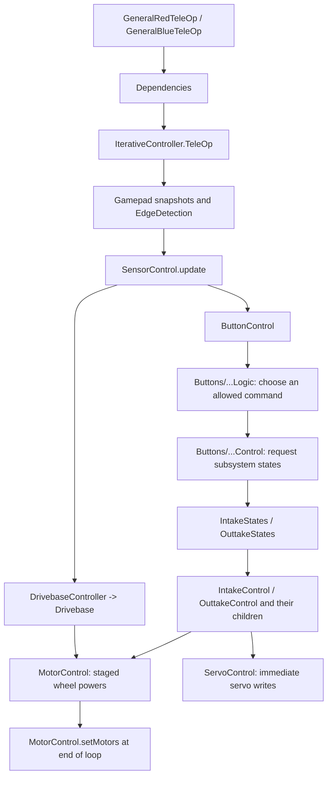

# Working with the robot skeleton

This module keeps the original package nesting under `src/main/java/org/firstinspires/ftc/teamcode`.
Names such as `Intake`, `Outtake`, `AutoCycleShoot` and `GoalAuton` remain to preserve that structure;
they do not implement a previous game's mechanisms. Their idle states are places to build the next robot.

## First run and controls

Configure these four devices as motors on the Robot Controller. Motor names are case-sensitive.
`HardwareInterface/Motor/MotorConstants.java` is the shared source for the names and motor groups.

| Motor | Configuration name | Direction in `MotorControl` |
| --- | --- | --- |
| Front left | `frontLeftMotor` | FORWARD |
| Back left | `backLeftMotor` | REVERSE |
| Front right | `frontRightMotor` | REVERSE |
| Back right | `backRightMotor` | FORWARD |

These directions and drive mixing are retained from the existing chassis, including its diagonal
reversals. They are not a generic mecanum wiring prescription. The motors initialize to zero power,
BRAKE and RUN_WITHOUT_ENCODER. Encoders are not reset merely by starting TeleOp.

Select `GeneralRedTeleOp` or `GeneralBlueTeleOp` in the Starter group. Both drive identically;
the alliance is shared context for future behavior. Only Driver Station START begins the drive loop.
Driver Station STOP exits the loop and the `finally` block stops motor and continuous-servo output.

| Input | Starter behavior |
| --- | --- |
| Gamepad 1 left stick | Forward/backward and strafe, relative to the robot |
| Gamepad 1 right stick X | Turn, using the retained sign convention |
| Share / Back | Toggle field orientation only when a heading sensor is explicitly configured |
| Options / Start | Reset heading only when a heading sensor is explicitly configured |
| Mechanism buttons | Routed to existing button classes, all currently unassigned |
| Gamepad 2 | Edges are refreshed; no operator actions or drive ownership are assigned |

`GlobalVariables.slowMode` reduces speed to `DrivebaseConstants.SLOW_SPEED` (0.5), but is false
on initialization and has no default button binding. It never changes which gamepad drives.
The normal maximum is 1.0. A missing heading sensor always leaves robot-oriented control available.

`GeneralAutonomous` allows Triangle/Y for red or Square/X for blue during INIT. Red is the default,
and no selection is required to START or STOP. Its only routine is `IDLE`, which commands no motion.

## How one TeleOp iteration works



The OpMode is the lifecycle boundary: initialize, wait for START, run short iterations, stop in
`finally`. It passes SDK objects (`hardwareMap`, gamepads and telemetry) into `Dependencies`.
That class creates one shared set of hardware adapters and injects them into controller factories.
Create a controller tree once per OpMode, rather than calling its factories every loop.

`IterativeController` refreshes both gamepads, reads configured sensors, processes button commands,
updates the drive and mechanisms, then flushes staged motor powers **in the same iteration**.
The edge detector compares current and previous snapshots: a rising edge fires once per press and
a falling edge once per release. Reading an edge does not consume it. Drive sticks remain analog.

A button's `Logic` class decides what is allowed, including future interlocks. Its `Control` class
translates that decision into subsystem state requests. Mechanism controllers read these requests
and command the hardware adapters. Autonomous requests the same subsystem states without pretending
to press controller buttons. `ButtonStates` is a one-shot command mailbox; subsystem `States` classes
hold the longer-lived mechanism requests.

The existing state holders are static. `GlobalVariables.reset()` and the controller constructors
reset them for each OpMode because the FTC app can run multiple matches in the same process.

## Where each piece belongs

| Folder / classes | Responsibility and connection |
| --- | --- |
| `Main/General*` | Driver Station entry points and START/STOP lifecycle |
| `Main/Dependencies` | Hardware ownership and controller constructor wiring |
| `Main/IterativeController` | TeleOp update ordering; input, sensors, intentions, output |
| `Main/AutonomousDependencies` | Shared wiring plus optional Road Runner drive and autonomous controller |
| `Main/GlobalVariables`, `Alliance` | Match context; reset at every entry point |
| `Main/ManualOpModes` | Disabled bench-test slots; implement and enable only the needed diagnostic |
| `Main/GoBildaPinpointDriver`, `Pose2D` | Optional Pinpoint driver and millimeter/radian pose helper |
| `HardwareInterface/Gamepad` | SDK input fields → named buttons → edges |
| `HardwareInterface/Motor` | Four configured motors, indexed groups, staged powers and encoder helpers |
| `HardwareInterface/Servo` | Empty servo configuration and shared adapter; commands apply immediately |
| `HardwareInterface/Sensor` | Optional measurements, heading reset and limit-switch adapter |
| `HardwareInterface/Slide` | Reusable interfaces and bounded target logic; no slide instantiated |
| `Subsystems/Control/Buttons/<Button>` | Per-button States / Logic / Control skeletons |
| `Subsystems/Drivebase` | Drive-mode selection and retained mecanum mixing |
| `Subsystems/Intake`, `Subsystems/Outtake` | Aggregate states, constants and injected child controllers |
| `Autonomous` | Pre-start choices, routine dispatch and non-blocking sequence template |
| `Autonomous/Trajectories` | Alliance-specific geometry; only a placeholder origin remains |
| `Roadrunner` | Optional trajectory following/localization and retained chassis tuning |
| `Roadrunner/trajectorysequence/sequencesegment` | Path, turn and wait primitives used by the sequence runner |
| `Roadrunner/opmode` | Disabled tuning tools; see [their setup notes](src/main/java/org/firstinspires/ftc/teamcode/Roadrunner/README.md) |
| `FTCDashboard` | Existing drawing, logging, encoder and tuning utilities supporting Road Runner |
| `Camera/LimeLight` | Disabled camera diagnostics with no season tag IDs, offsets or scoring decisions |
| `Other` | Disabled experiment slot; do not put production behavior here |

The root-level historical kit-robot class is a disabled alias for the starter TeleOp. SDK samples
in `FtcRobotController` remain reference material and are separate from the team controller tree.

## Adding a mechanism

1. **Define its hardware.** For a motor, add a physical slot, increment `MOTOR_COUNT`, map the device
   in `MotorControl`, and update `motorConfig` in `MotorConstants`. The integer constants index group
   rows, so update group indices if rows move. Include every motor in `all`; include only mechanisms
   in `notDrive`. Configure its direction, run mode and zero-power behavior explicitly.
2. **For a servo**, add its name and matching measured minimum/maximum entries to `ServoConstants`.
   CR servos use their own name array. There is no automatic start position: add a calibrated one
   in `ServoControl.setServoStartPos()` if appropriate. Add feedback sensors in `SensorControl`.
3. **Add states and calibration** to the relevant child `...States` enum and subsystem `...Constants`.
   The empty constants classes intentionally contain no old powers, servo positions or timings.
4. **Implement the child controller.** It receives a shared hardware adapter through its constructor.
   A motor/CR-servo idle state must command zero once that device exists. Positional-servo idle
   behavior must be chosen for the actual mechanism. Keep every update short and non-blocking.
5. **Wire it in `Dependencies`**, call it from the aggregate subsystem controller, and update that
   aggregate's activity predicate. Reset any new state in `setInitialStates()`. Add new subsystems
   to both TeleOp and autonomous loops if both should operate them.
6. **Bind an input.** Add a command enum case in a button folder, choose it in `...Logic`, and set
   the subsystem request in `...Control`. Clear the one-shot command afterward. Gamepad 2 has its own
   edge detector; assign operator mappings explicitly rather than executing identical bindings twice.
7. **Check the mechanism alone** in an implemented bench-test slot before integrating a sequence.
   Ensure the OpMode's cleanup stops its actuators. Do not copy hardware mapping into button classes.

For a simple future motor action, the chain is:
`RightBumperLogic` chooses a command → `RightBumperControl` sets a mechanism state → the mechanism's
motor controller stages power with `MotorControl.setMotorSpeed(...)` → the loop flush applies it.
The next idle request must stage zero so the previous power cannot persist.

The slide helpers are optional. `SlideLogic` resets encoders on construction, so use it only after
defining and reaching the mechanism's physical zero. It does not implement homing by itself.

## Adding autonomous and sensors

Road Runner is off by default (`AutonomousConstants.USE_ROAD_RUNNER = false`). Enabling it constructs
`SampleMecanumDrive`, which needs the four motor names plus `pinpointIMU`. Read the Road Runner notes,
configure odometry and verify calibration before enabling paths. TeleOp field orientation is a
separate opt-in: call `sensorControl.initPinpoint()` in the TeleOp dependency initialization.
Do not create competing sensor owners or reset a localizer after seeding its autonomous start pose.

Add named path methods to `Trajectories` and implement them in `RedTrajectories` and `BlueTrajectories`.
Use **inches and radians** for Road Runner. The origin `(0, 0, 0)` is only a placeholder. Use measured
start poses and field geometry for the new competition, and keep mechanism commands out of geometry.

Extend `AutonomousMode` and pre-start selection when adding a real routine. `GoalAuton` retains the
routine extension point: select alliance paths in `setTrajectorySide()`, initialize once in `start()`,
and advance stages in `run()`. Start motion with the async trajectory methods, then check `isBusy()`
on later iterations. `GeneralAutonomous` calls `drive.update()` each active loop. Use elapsed-time
checks for waits so sensors, mechanisms and STOP continue to be serviced.

During Road Runner autonomous, **only Road Runner writes the drive motors**. `AutonomousControl`
flushes `MotorConstants.notDrive`, which is currently empty. Calling the TeleOp controller or flushing
`all` alongside Road Runner would overwrite its drive output. Cleanup still zeros every motor.

`SensorControl` constructs without peripherals. Add explicit mapping/init methods for new sensors;
read once per loop in `update()`, then expose cached measurements. Keep heading getters free of resets
and I/O. If adding a camera, stop its stream in `SensorControl.stop()`. Camera diagnostics report raw
pipeline results; target selection and field-specific calculations belong in new behavior code.

## Verification and limits

From the repository root, with JDK 17 and the Android SDK configured:

```sh
bash gradlew :TeamCode:testDebugUnitTest :TeamCode:assembleDebug :MeepMeepTesting:compileJava
```

`src/test/.../StarterRobotTest.java` checks the four hardware names/directions, immediate drive output,
strafe/turn normalization, stop behavior, button edges, optional hardware, and non-blocking selection.
The unit test report is `build/reports/tests/testDebugUnitTest/index.html` inside TeamCode.

Before physical use, verify wheel directions, neutral-stick stop and Driver Station STOP with the
robot supported. Optional odometry, field orientation, future servo positions and new mechanisms need
hardware testing and calibration; a JVM test cannot establish those physical properties.
